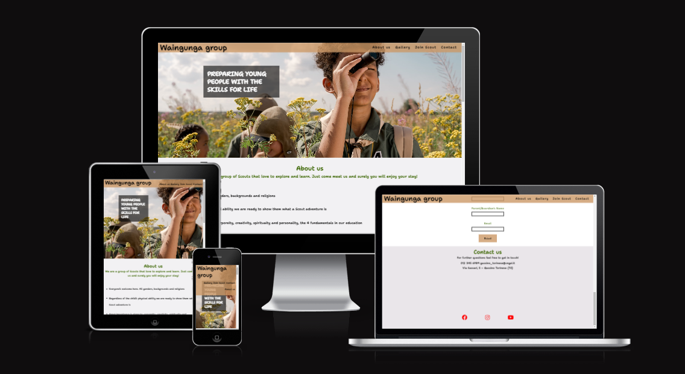
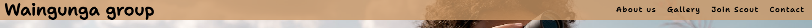
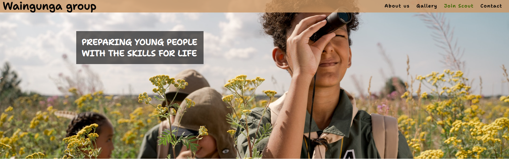
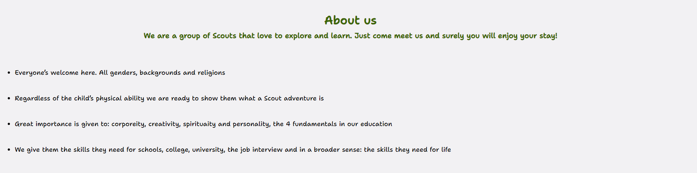
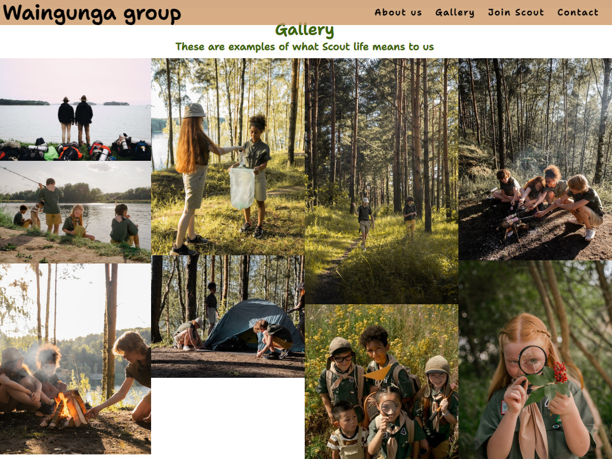
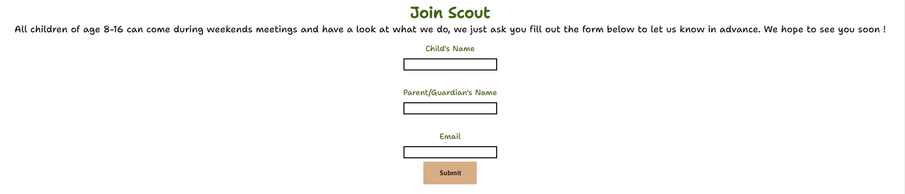

# Waingunga group

Waingunga group is a website that aim to let people know about our Scout community and hopes to inspire someone to get part of it. The site is targeted to parents that want to let their children experience the Scout world, which will prepare them with skills for life. 
<h2 align="center"></h2>

## FEATURES
 

- Navigation bar
- Main image
- About us
- Gallery
- Join Scout
- Footer

### Navigation bar

- The navigation bar is the main tool for the user in order to navigate on the site, through the menu it's easy to move to the different sections of the webpage.
<h2 align="center"></h2>

### Main image

- This image paired with the text overlay helps the user immediatly understand the aim of the website.
<h2 align="center"></h2>

### About us

- The about us section allow an easy overlook on the opportunities the children joining will be experiencing.
Clearly states that no requirements are needed either by the children or the parents when joining.
<h2 align="center"></h2>

### Gallery

- The gallery it's a collection of images that show the user what to expect, especially for the children.
- This simple activities are just a fraction of all the experiences, but good enough to see how scouting works.
<h2 align="center"></h2>

### Join Scout

- This section is more relevant for the devloper and not the user, in fact it's the only requirement throughout the entire website and it's essential for he organisers.
<h2 align="center"></h2>

### Footer

- The footer includes both relevant contact information and the social media sites. The links will open to a new tab 
 for an easier navigation.
<h2 align="center"></h2>

## Testing 

- errors found when using [W3C validator](https://validator.w3.org) 
- No errors found when using [(Jigsaw) validator](https://jigsaw.w3.org/css-validator/)

## Deployment
- The site was deployed to GitHub pages. The steps to deploy are as follows:
    - Log in to GitHub and locate the GitHub Repository
    - At the top of the Repository, locate the "Settings" Button on the menu.
    - Scroll down the Settings page until you locate the "Pages" Section.
    - Under "Branch", click the dropdown called "None" and select "main".
    - Refresh the page and you should be able to click on the site link.
- Here you can find the live link: (https://oxyotl.github.io/Project-portfolio-1/)

## Credits
- ### Code
    - Few snippets of code wre taken from these two sites [W3Schools](https://www.w3schools.com/default.asp#gsc.tab=0&gsc.q=screen%20scale), [Stack Overflow](https://stackoverflow.com/).
- ### Media 
    - All images were taken from [Pexels](https://www.pexels.com/it-it/).
    - The social media icons are from [Font Awesome](https://fontawesome.com/)
- ### Acknowledgments
    - My mentor really helped me with very usefull feedbacks.